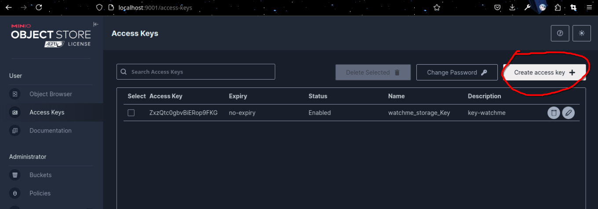
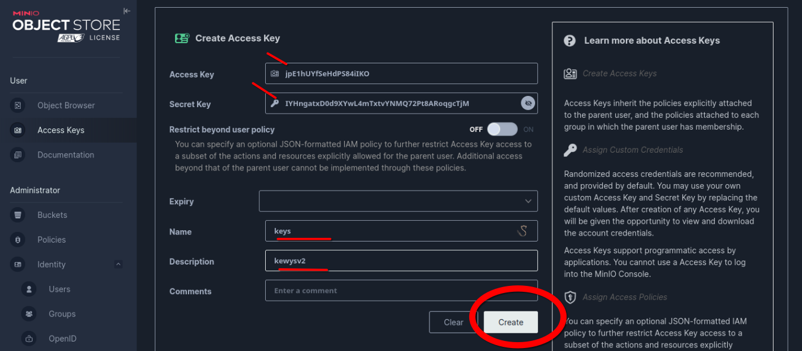
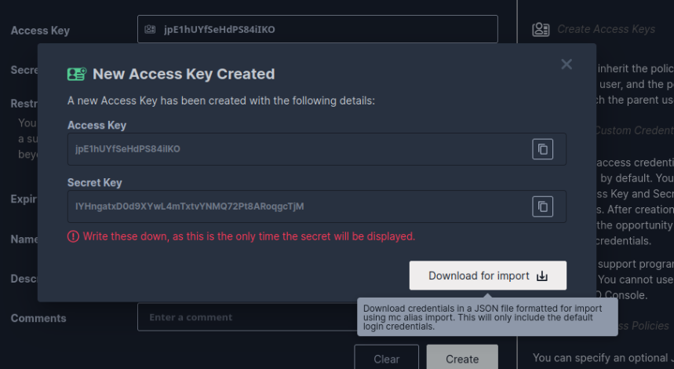
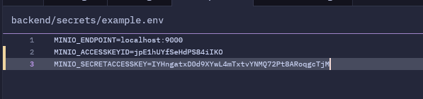

# WatchME

A movie streaming backend


## Run Locally

Clone the project

```bash
  gh repo clone WatchMe-2-0/watchme
```

Go to the project directory

```bash
  cd watchme
```

Install dependencies

```bash
  go mod tidy
```

Before starting the server run


```bash
  docker-compose up
```
By running this
- `minio-storage`
- `postgres-db`
these two `container` will start locally for

minio
- `http:localhost:9001` -- minio client web ui
- `http:localhost:9000` -- minio server api

postgres-db
- `http:localhost:5432`


## Environment Variables

This are the basic yml written in `docker-compose.yml`
for `postgres`
```bash
  environment:
      POSTGRES_USER: admin
      POSTGRES_PASSWORD: admin
      POSTGRES_DB: moviesdb`
```
for `minio`
```bash
      environment:
      MINIO_ROOT_USER: admin
      MINIO_ROOT_PASSWORD: admin123
```

and there is an `app.env` file which will you need to configure by going to


## Screenshots
Go here
`http://localhost:9001/access-keys`
and create the accesskeys






add the keys accordingly in `example.env` and also rename the `example.env` to `app.env`
THIS IS IMPORTANT!!!



## Api's Work with curl


using `curl`

To uploading movies
Post `http://localhost/upload`
```bash
curl -X POST http://localhost:8000/upload \
  -F "title=Interstellar" \
  -F "movie=@/path/to/interstellar.mp4" \
  -F "poster=@/path/to/interstellar.jpg"
```
To Get all movies
Get `http://localhost:8000/movies`
```bash
 curl -X GET http://localhost:8000/movies
```
To stream the movie
GET `http://localhost:8000/stream/:name`
```bash
curl -X GET http://localhost:8000/stream/1741891860-interstellar.mp4
```
To delete
delete `curl -X DELETE http://localhost:8000/movies/{movie.id}`

to know the ID use
` curl -X GET http://localhost:8000/movies`
output
```bash
{"ID":4, -- this is the ID
"Title":"alooposto",
"PosterURL":"http://localhost:8000/posters/1741891860-7a32830bdcf1dc41e5245d6a944406a2.jpg",
"StreamURL":"http://localhost:8000/stream/1741891860-alooposto.mp4",
"CreatedAt":"2025-03-14T00:21:00.976905+05:30"}
```
